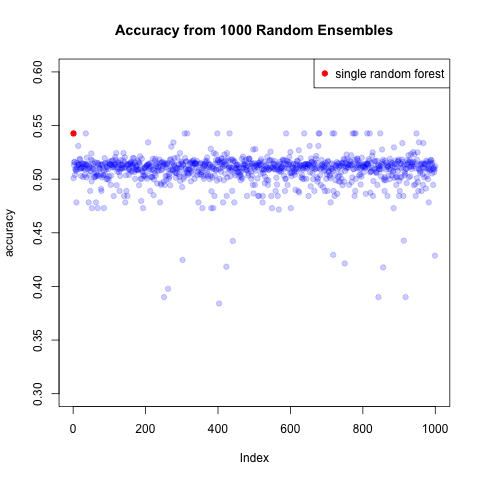
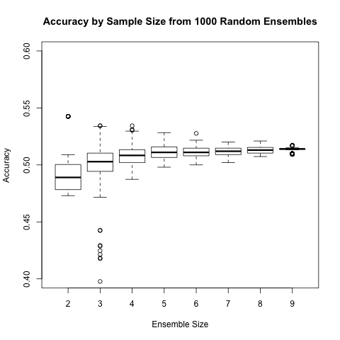
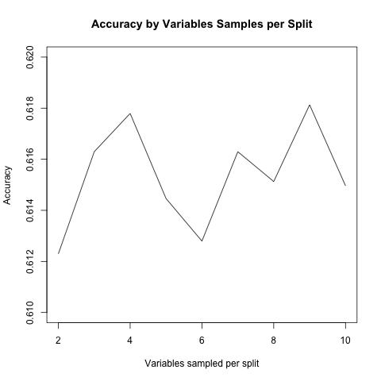
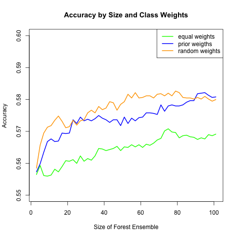

# Ensemble Testing

The concept of ensembling has become popular from the intuitive idea that more heads are better than one. It has been shown that making predicions from a collection of models can have greater predictive power than one very good model.

The process to create an ensemble was as follows:

1. Train a collection of models, using caret for tuning, on a smallish data set to iterate faster, on the same training set
2. Evaluate the accuracy of each model on the same test (e.g. validation) data set
3. Evaluate the accuracy of an ensemble of models having low correlation in predictions

The results of this experiment on the Mashable data set are that while it improved predictive power of nearly all models alone, it did not improve the predictive power of randomForest alone.

Below is a plot of the correlations:

Ensembling predictions from the least correlated models resulted in lower predictive power. In order to affirm this result, we ran 1000 simulations with different random sizes and selections of the model predictions available.

## Ensembling Random Forests

Since ensembling different models was unsuccessful, we doubled down on random forest. Most parameters were tested for optimal tuning and it was found the default tuning (e.g. nodesize, mtry, ntrees) were hard to improve upon.

I was particularly interested in the effect of tuning classwt parameter: Could it be ensembled randomly to produce greater predictive power?

