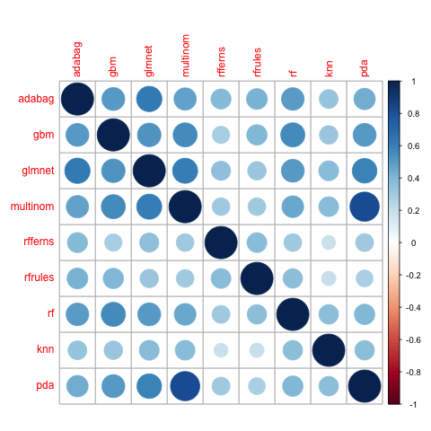
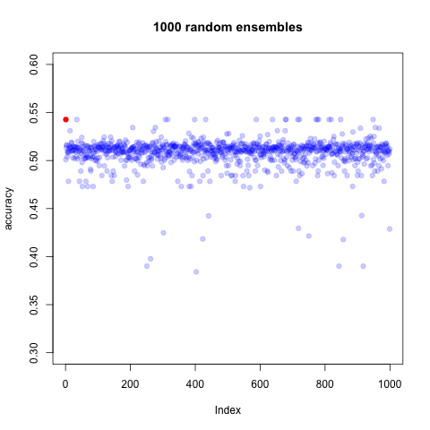
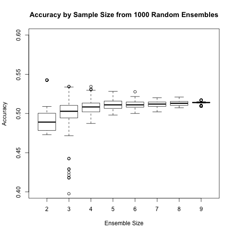
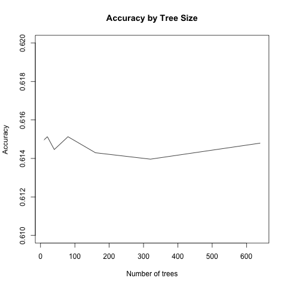
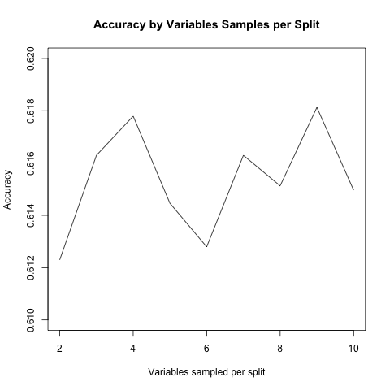
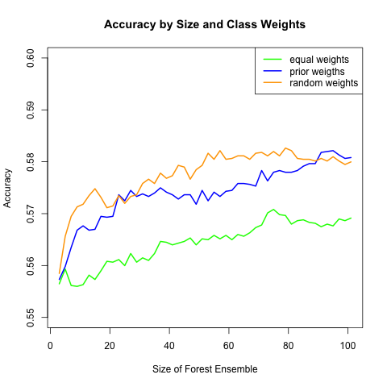

```{r, echo=FALSE, warning=FALSE}
source("../Zsuzsi/data_read.R")
library("ggplot2")
```

##Data discovery
###Explore relationship between numeric data
Simple correlations for non-categorical variables visualised. Stronger correlations between variables of the same category. It might go the the PCA section?

```{r, echo=FALSE}
#Correlations for numeric data
library(reshape2)

corr <-round(cor( data[,sort(c(x.numeric,x.rate))], method="pearson", use="pairwise.complete.obs"),2)
corr[lower.tri(corr)] <- NA
corr <- melt(corr)
corr$Var1<-as.character(corr$Var1)
corr$Var2<-as.character(corr$Var2)
corr <- na.omit(corr)

ggplot(corr, aes(Var2, Var1))+
  geom_tile(data=corr, aes(fill=value), color="white")+
  scale_fill_gradient2(low="blue", high="red", mid="white", 
                       midpoint=0, limit=c(-1,1),name="Correlation\n(Pearson)")+
  theme(axis.text.x = element_text(angle=45, vjust=1, size=11, hjust=1))+
  coord_equal()

```

###Explore relationships between categorical variables (including our y variable.)
Mosaic plot: Shows empirical conditional probabilities of row variable given column variable. Colored by Pearson residuals which shows the departure of each cell from independence. It seems that days are correraletd with the popularity especially significant difference between weekday and weekends. Also, chanel seems to be strongly related to the popularity of articles. 

```{r, echo=FALSE, warning=FALSE}
#contingency tables
tbl.channel = table( data[,y] , data[,"data_chanel"]) 
freq.tbl.channel = tbl.channel*100/sum(tbl.channel)

tbl.weekday = table( data[,y] , data[,"weekday"]) 
freq.tbl.weekday = tbl.weekday*100/sum(tbl.weekday)

mosaicplot(t(tbl.channel), shade=T, main="Relationship of popularity and chanel", off = 25 )

```

```{r, echo=FALSE, warning=FALSE}
mosaicplot(t(tbl.weekday), shade=T, main="Relationship of popularity and day of week")
```

##Fisher score based logistic regression
For finding the right variables for prediction with logistic regression we applied a simple strategy. We computed fisher scores between popularity and the each of the possible explanatory variables and ranked the variables based on this score. Then starting from the simplest model we added variables by fisher score ranking one-by one. Finally we selected the best performing model based in prediction accuracy based on Bayesian information criterion. This method can be considered as a version of stepwise regression where the models considered are based on a specific variable ranking. The best model obtaine this way had an accuracy arond 49%. 

We also tried to fit an ordered logit model to take into account the fact that outcome measure is not a simple categorical but an ordinal variable. Using ordered logit yielded very similar result as the multinomial logit. The best achieved accuracy was around 49%.

```{r, echo=FALSE, warning=FALSE}
bic.all= read.table(file="bic.csv")
ggplot(bic.all, aes( x=novars , y=value , color=variable ))  + geom_line() + facet_grid(variable~. , scales = "free") + scale_y_continuous( "BOC")
```

# Ensemble Testing

The concept of ensembling has become popular from the intuitive idea that more heads are better than one. It has been shown that making predicions from a collection of models can have greater predictive power than one very good model.

The process to create an ensemble was as follows:

1. Train a collection of models, using caret for tuning, on a smallish data set to iterate faster, on the same training set
2. Evaluate the accuracy of each model on the same test (e.g. validation) data set
3. Evaluate the accuracy of an ensemble of models having low correlation in predictions

The results of this experiment on the Mashable data set are that while it improved predictive power of nearly all models alone, it did not improve the predictive power of randomForest alone.

Below is a plot of the correlations:



Ensembling predictions from the least correlated models resulted in lower predictive power. In order to affirm this result, we ran 1000 simulations with different random sizes and selections of the model predictions available.





## Ensembling Random Forests

Since ensembling different models was unsuccessful, we doubled down on random forest. Most parameters were tested for optimal tuning and it was found the default tuning (e.g. nodesize, mtry, ntrees) were hard to improve upon.





I was particularly interested in the effect of tuning classwt parameter: Could it be ensembled randomly to produce greater predictive power?




